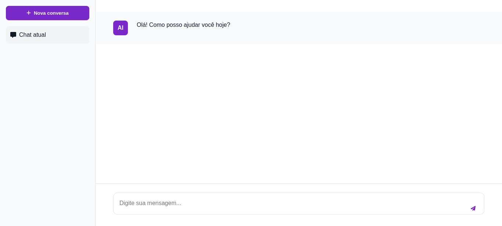

# Chat AI Interface

Uma interface moderna de chat inspirada no Claude AI, construída com HTML, CSS e JavaScript puro.



<div align="center">
  
  <p><em>Interface do Chat AI em ação</em></p>
</div>

## 🌟 Características

- 💬 Interface moderna e responsiva
- ✨ Animações suaves
- 🔄 Indicador de digitação
- 📝 Suporte a Markdown
- 🎨 Design inspirado no Claude AI
- 📚 Sistema de histórico de chat
- 🎯 Totalmente personalizável

## 🚀 Como usar

1. Clone o repositório
```bash
git clone https://github.com/seu-usuario/chat-ai-interface.git
```

2. Abra o projeto
```bash
cd chat-ai-interface
```

3. Abra o arquivo `index.html` em seu navegador ou use um servidor local

## 📁 Estrutura do Projeto

```
chat-ai-interface/
├── assets/
│   ├── css/
│   │   └── style.css
│   ├── js/
│   │   └── main.js
│   └── images/
│       ├── demo.gif
│       └── preview.png
├── index.html
├── README.md
├── LICENSE
└── .gitignore
```

## 🎨 Personalização

Você pode personalizar o tema editando as variáveis CSS em `assets/css/style.css`:

```css
:root {
  --bg-primary: #ffffff;
  --bg-secondary: #f9fafb;
  --text-primary: #111827;
  --text-secondary: #6b7280;
  --brand-purple: #7928CA;
  --brand-purple-light: #9333ea;
  --border-color: #e5e7eb;
  --hover-bg: #f3f4f6;
}
```

## 🤝 Contribuição

1. Faça um Fork do projeto
2. Crie uma Branch para sua Feature (`git checkout -b feature/AmazingFeature`)
3. Commit suas mudanças (`git commit -m 'Add some AmazingFeature'`)
4. Push para a Branch (`git push origin feature/AmazingFeature`)
5. Abra um Pull Request

## 📝 Licença

Distribuído sob a licença MIT. Veja `LICENSE` para mais informações.

## 📞 Contato

https://www.linkedin.com/in/dheiver-santos/

Link do Projeto: [https://github.com/seu-usuario/chat-ai-interface](https://github.com/seu-usuario/chat-ai-interface)


## ⭐ Deixe uma Estrela!

Se este projeto te ajudou, deixe uma estrela!
